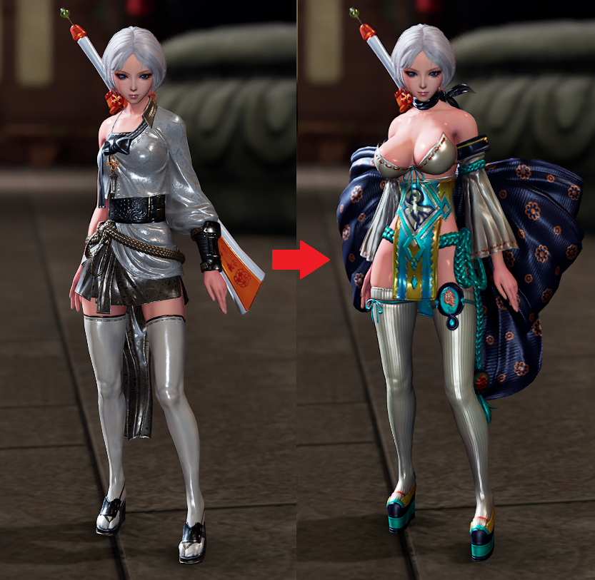

# BNS Datafile Plugin ItemSwap

A plugin for BNS that allows you to intercept and modify item data lookups using ImGui for configuration.

## Features

- **Item Swapping**: Swap item data lookups dynamically
- **ImGui Integration**: Built-in UI panels for plugin configuration and item browsing

## Example outfit swap

## Special Ids
- `69696969` - Zulia Outfit  (JinF only)
- `69696970` - Lancer Outfit (Jin only)

## Disclaimer
- The config xml of versions prior to 2.0.0 is not compatible.

## 🔗 Dependencies

- [DatafilePluginloader](https://github.com/leanleon93/BnsPlugin_DatafilePluginloader) v1.5.0 or higher is required to use this plugin.

---

**Author**: LEaN
